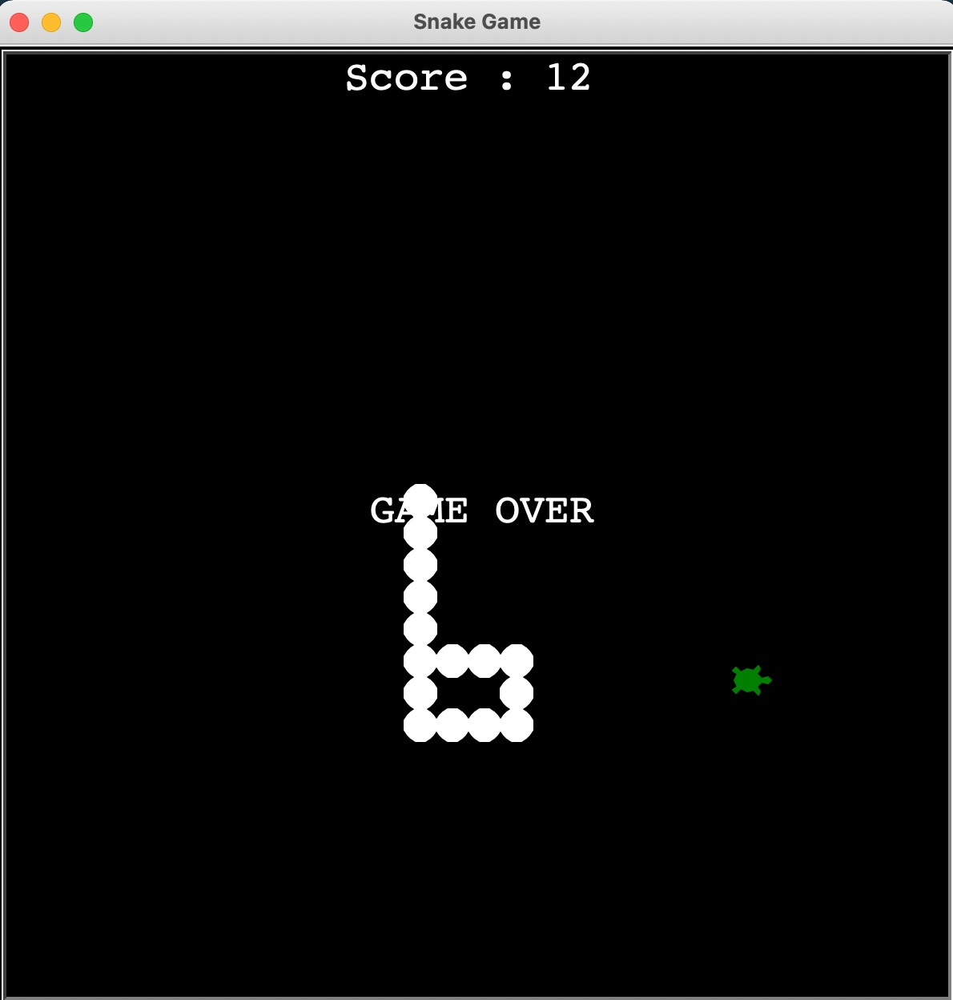
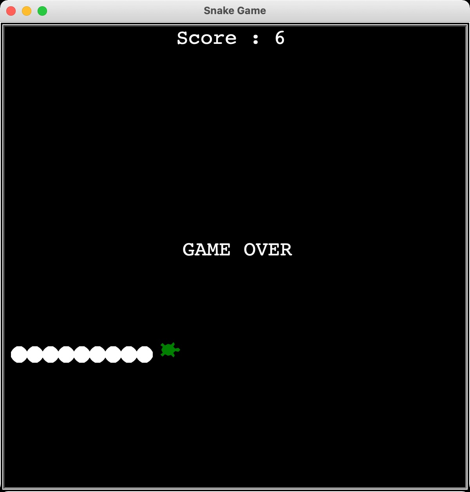

# Snake_Game
Python Project

Steps:

*** Steps to be followed while making the snake game ***

1. create a snake body
2. move the snake
3. control the snake

4. detect collision with food
5. create a scoreboard
6. detect collision with a wall
7. detect collision with a tail

